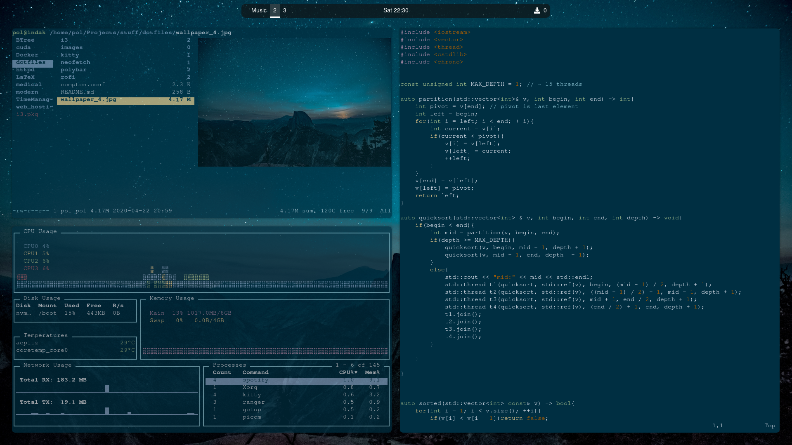

# Personal dotfile configuration 

This is my personal dotfiles of my first linux ricing. 
* Distro: Arch Linux 
* Window Manager: i3wm 
* Display Manager: lightdm 
* Compositor: picom-rounded-corners 
* Terminal: kitty  
* Cmatrix
* pipesh 
* Nyancat
* neofetch
* htop / bashtop 

